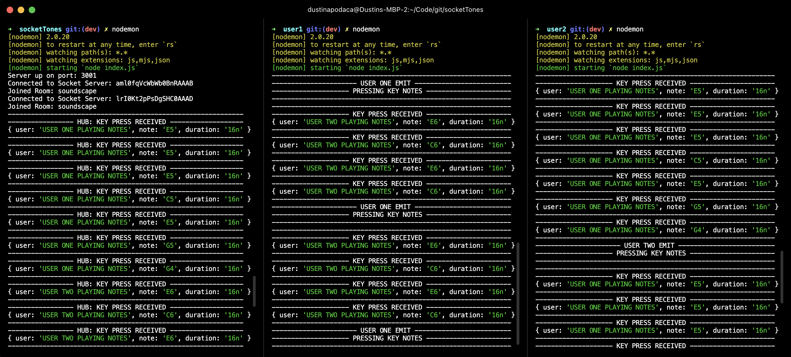
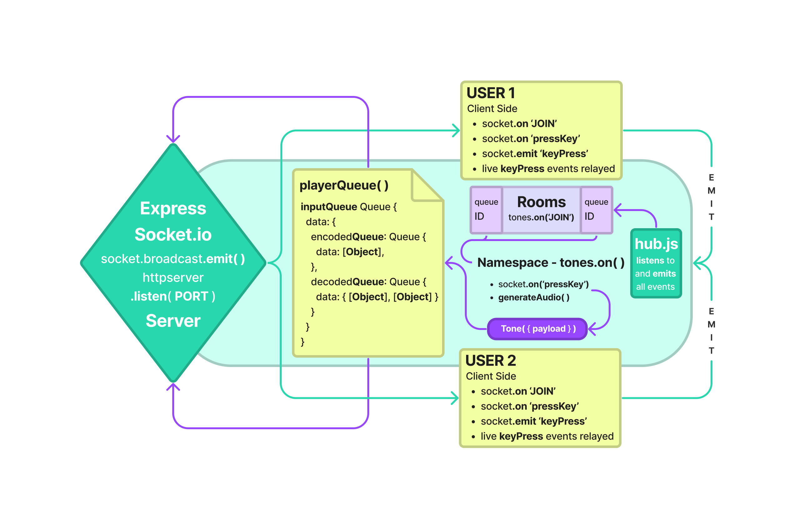

# Project: socketTones
### Author: Dustin Apodaca & Trace Dugar
---
### Event Driven Application
### Express & Socket.io
### Tones.js
---
##  Problem Domain

- Responsible for planning, executing, and presenting an application that showcases an event driven architecture
- A simple and efficient way to share musical ideas live in real time.
- A “hub” Socket Server that moderates all events
- Multiple “clients” that connect to the hub which can both publish and subscribe to events
- Must operate over a network

## Output Representation

#### How to initialize/run your application (where applicable)

- `npm start`
- `nodemon`
- `node index.js`

##  Features / Routes

- Express Server with Socket.io Hub
- Socket.io Hub:
  - `io` - Socket.io server instance
  - `tones` - Socket.io namespace
  - `logger` - to log all events
  - `tones.on('connection', socket)` - to listen for new connections
  - `socket.join(soundscapes)` - room implementation
  - `socket.on('keyPress', payload)` - listens for live keyPress events and emits to all other connected clients in the room.

- User 1 (Client):
  - `socket.on('keyPress', payload)` - listens for live keyPress events from other users.
  - `socket.emit('keyPress', payload)` - emits the specific keyPress event to the room including the note pressed, and duration of the press, utilizing a keyMap object.

- User 2 (Client):
  - `socket.on('keyPress', payload)` - listens for live keyPress events from other users.
  - `socket.emit('keyPress', payload)` - emits the specific keyPress event to the room including the note pressed, and duration of the press, utilizing a keyMap object.

### Tests

- How do you run tests?
  - `npm test`

## UML
Link to an image of the UML for your application and response to events:

